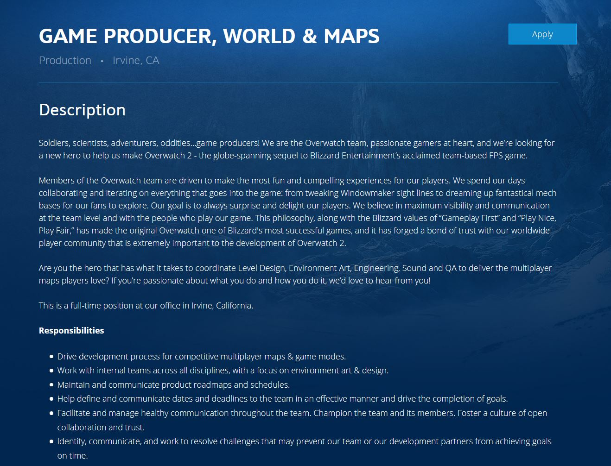

<html>
<head>
  <h1 style="font-family:Calibri; color:#34495e;">
    Welcome to my profile!
  </h1>
</head>
<body>
  <h2 style="font-family:Calibri; color:#34495e;">
    About Me.
  </h2>
  

  

  

  Name: Justin Turner  
   Student No.: s3792793  
   Email: s3792793@student.rmit.edu.au 
   Nationality: Australian 
   Education to Date: Year 12 Certificate/ATAR 
   Languages Spoken: English 
   Pet: I have a boxer named Ali 
   Hobbies: I enjoy playing basketball and lots of video games. 
  

  <h2 style="font-family:Calibri; color:#34495e;">
    Online Test Results
  </h2>
  

  Myers Briggs Result: ENTP - The Inventor 
   Learning Style Result: Auditiory/Visual Learner 
   Creativity Test Result: 58.29 creativity score 
   My results indicate that I am a problem solver, that I learn best from seeing a 
  process completed, and hearing an explanation of it and why we do it. I am slightly 
  above average with my creativity. The test results merely confirm what I already know 
  about myself. I learn the most effectively when I watch people/ videos on a topic or 
  listen to a lecture, and I have always found logic and problem solving challenges with 
  definite correct answers such as math and coding, easier than more creative/ imaginative 
  tasks such as writing essays. 
   Due to these results I believe my best work will be completed when we talk through ideas/ 
  challenges as a group, and the best way for me to function in team meetings will be via voice 
  communications due to my auditory learning style as visual will be a challenge via correspondence. 
  I think my strengths in workload will be in a coding role or some other problem solving area with 
  a definite correct or wrong answer available. 
   I think when forming a team it is best to get people of different learning styles and personality 
  types to complement the strengths and weaknesses of each. Obviously, these tests shouldn’t be the deciding 
  factors when making a group, but they give a nice indication as to how people in the group will perform and 
  co-exist. 
  

  <h2 style="font-family:Calibri; color:#34495e;">
  Why does IT interest me?
  </h2>
  

  I am interested in IT as I enjoy problem solving and have thoroughly enjoyed 
  programming/ coding which I completed in a previous degree. I was undertaking 
  an engineering degree previously and I found myself enjoying the programming 
  elements of the course while not seeing a future for myself in engineering, 
  this started my interest in undertaking the IT course and to attempt to work 
  my way to a programming role. I currently work in a system support role for a 
  media company, but have no further experience besides that. 
   I chose to come to RMIT as the option to study via correspondence was very 
  flexible and the university has a great reputation, especially in the IT field. 
  Because I work full time it is important for me to have the flexibility to study 
  when time permits it and this course allows that. 
   During the degree I expect to gain proficiency in a variety of different 
  programming languages and systems, and to ready myself for the workforce. 
  

  <h2 style="font-family:Calibri; color:#34495e;">
  My Ideal Job
  </h2>
  

   
   Link to the advertisement: <a href="https://jobs.jobvite.com/blizzard/job/oCUvbfwW" target="_blank">Click Here</a> 
   I have always had a strong passion for video games, and I have always 
  wanted to have the opportunity to work in the industry. A lot of my favourite 
  games are developed by Blizzard Entertainment and I would love the opportunity 
  to work on these as well. The advertisement I have selected is a game producer 
  for Blizzard, which also means I get to do programming which is something I 
  really enjoy. 
   I would need to obtain an IT degree as the minimum qualification. To get 
  a job in a large game development company I would need to gather experience 
  in the game industry. This could both be done by working on my own projects 
  and developing a portfolio for display or by working in other development 
  studios. Another potential path to make myself more desirable for the position 
  would be to complete an Honors/ Masters in IT to further use qualifications 
  to display my proficiency in programming. 
   My plan to gain these skills/ qualifications is to complete my degree and 
  simultaneously work on personal coding projects. These need not just be 
  gaming projects, but need to test my skills to demonstrate a passion/ 
  proficiency in coding. I would then create a webpage which would function 
  similar to a resume and would display project ideas I have and my development
  processes for display. Once my bachelor of IT is finished I would enter the 
  workforce and attempt to get entry into the game industry as a developer. 
  Failing this I would look for a job as a programmer, and in both cases attempt 
  to work on small personal games to use in my portfolio. When I believe I have 
  gained enough experience and my portfolio is impressive I would approach 
  Blizzard and keep attempting to gain employment in the roles, and continue 
  developing my experience on the side. 
  

  <h2 style="font-family:Calibri; color:#34495e;">
  My Project Idea
  </h2>
  

  My project idea is to use unity to create a 2d precision platformer video
  game. I want it to be a very challenging experience, but rewarding, and to 
  encourage player exploration/ curiosity. It will be a single-player only 
  experience, I know that a lot of the video-game player-base has a demand 
  for the multi-player functionality in today’s games but I think production 
  time should be fully spent on the single-player experience to ensure it runs 
  and plays to expectations. 
   I have always had a large interest in gaming and often find myself theorizing
  a perfect game I would want to play. One of my favourite series is the dark 
  souls series with the challenge they provide, and I would want to capture that 
  feel in a game I design. The video game industry is always on the rise, and 
  while the market can be oversaturated, this is something I am passionate about 
  and I believe the community responds well to good game ideas that show a love 
  and care put into them. The video gaming market is on the constant rise with 
  the market generating approximately 152 billion in 2019. 
   In terms of game design, the experience will initially be in black and 
  white and you can only interact with platforms that are of the opposite colour 
  to you, so shadows and other changes in shades will have an impact on movement. 
  As you progress throughout the game you will unlock colours which will add some 
  life to the animations, but will also bring danger along with them. For example,
  red will add the colour to models and scenery where it fits in, but also adds 
  fire and lava as traps to avoid. The hero won’t gain any new powers itself, 
  but with the addition of the new colours further gameplay and platforming 
  options will become available to \eep the experience fresh. The boss fights 
  will involve you surviving against them for a period of time, their attempted 
  attacks slowly adding the new colour to the world until they inevitably cause 
  their own demise. The game will be semi-linear and will continue through 
  different worlds/ environments, but there will be portals unlocked throughout 
  the game to revisit past areas and find collectibles and secrets that are 
  missed. There will be no multiplayer elements in the game as I think this adds 
  an unnecessary challenge to the development of the game. As the game itself is 
  a challenging precision platformer and can become quite frustrating, secret 
  levels will be hidden throughout the game which will contain mini-games separate
  from the normal platforming for a nice, short break from the tough main 
  experience. The art-style will be simplistic but stylized, with a cartoon feel 
  too it. I would like it to start off with a pixelized look, but as more colours
  are unlocked it slowly un-pixelates as well. The attacks of enemies with colour 
  involved will look like a paint brush stroke or splat on the screen and will 
  look slightly more realistic than the rest of the sprites/ animations. There 
  will also be a story, but similar to the dark souls story it will be vague and 
  in the background, so players will need to pay attention to what is happening 
  and formulate their own theories on what is happening. 
  To develop the game we will utilize the Unity engine as it has a 2D mode 
  within which will assist with development. Photoshop will be used to create 
  the assets for the game, but I will outsource the designing to a graphics 
  artist so the vision can be properly captured. In terms of hardware I believe 
  my computer is up to the task with 16gb or RAM, a GTX 1060, and an Intel 
  Core I5-9600 so no further purchases would be needed there, but if additional
  people were to join in on the task we would need to look at potentially 
  setting up a server for easier collaboration. 
   The main coding languages for Unity is C# and Java. I would need to develop 
  my proficiency in one of the languages and start practicing programming with 
  them in a game development setting, I would prefer C# out of the two as it 
  loosely applies to a variety of different gaming engines and prepares me 
  with a base knowledge for other endeavours. Another big challenge will be 
  also be gaining proficiency with the Unity platform itself, I chose this 
  platform as the game will be a simplistic 2D design and this engine fits 
  in well with this. We would need to design the sprites and animations and 
  I believe this could be achieved using photoshop as they are only 2d sprites. 
  I would probably lean towards hiring a graphics artist however and utilize 
  their expertise along with my vision to achieve the wanted design. 
   If the project is successful there will be a game available that provides 
  a challenging experience with a high focus on gameplay. I believe that a lot 
  of games at this stage put a lot of focus into graphics and how things look, 
  but I personally enjoy a stylized, simplistic feel that has a high emphasis 
  on gameplay and player skill. The game will be challenging, and while I 
  recognize that this isn’t for everyone, my main goal is to create a video game 
  that I would personally love to play and I hope others agree with me. 
  

  <h2 style="font-family:Calibri; color:#34495e;">
  Bibliography
  </h2>
  

  Wijman, T. (2019). <i>The Global Games Market Will Generate $152.1 Billion in 2019 as the U.S. Overtakes China as the     Biggest Market | Newzoo.</i> [online] Newzoo. Available at: https://newzoo.com/insights/articles/the-global-games-market-will-generate-152-1-billion-in-2019-as-the-u-s-overtakes-china-as-the-biggest-market/ [Accessed 10 Dec. 2019]. 
   Truity. (2019). <i>The TypeFinder® Personality Test.</i> [online] Available at: https://www.truity.com/test/type-finder-personality-test-new [Accessed 8 Dec. 2019]. 
   Educationplanner.org. (2019). <i>What's Your Learning Style?.</i> [online] Available at: http://www.educationplanner.org/students/self-assessments/learning-styles.shtml [Accessed 8 Dec. 2019]. 
   Testmycreativity.com. (2019). <i>Free online creativity test - TestMyCreativity.</i> [online] Available at: http://www.testmycreativity.com/ [Accessed 8 Dec. 2019]. 
  

  </body>
  </html>
